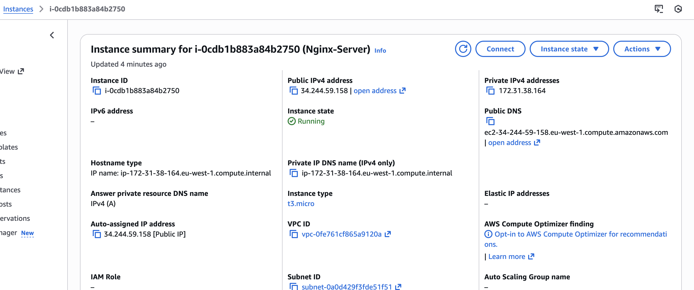
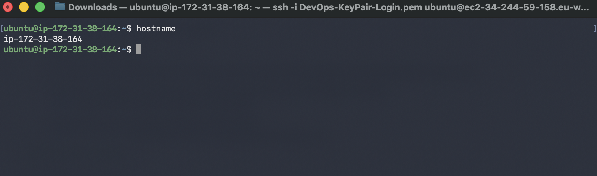
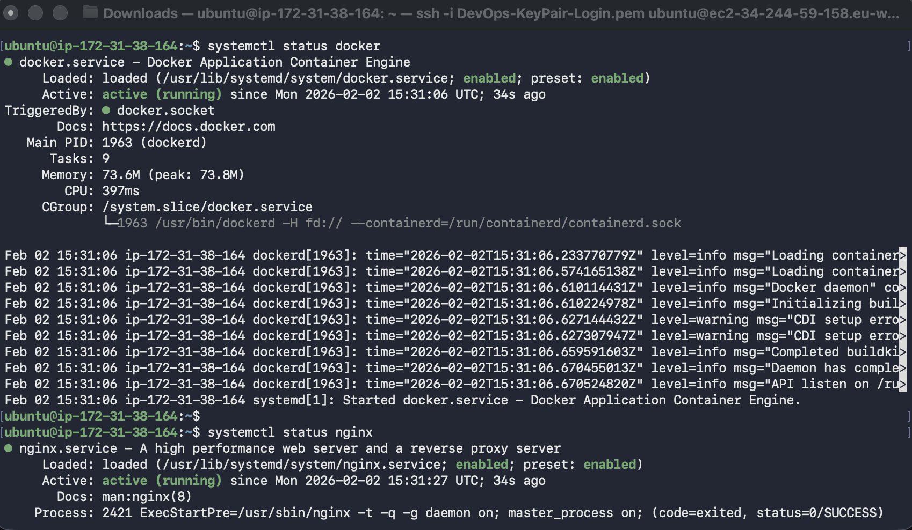
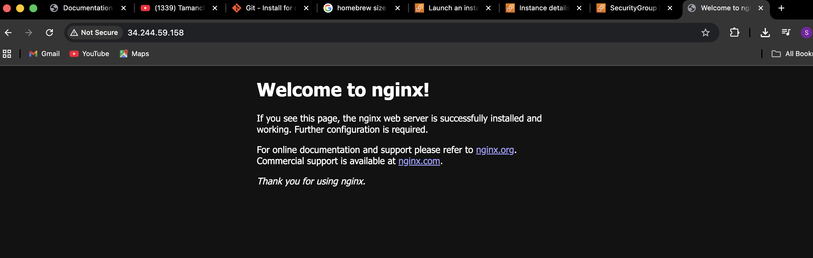
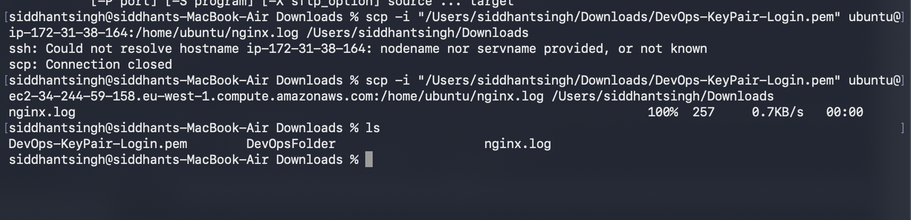

# Day 8 of 90dayschallenge

# Part-1 Create Cloud Instance and Connected by SSH

Created Cloud Instance 
I have create cloud instance on AWS:

Connected using SSH:
Below Screenshot Shows that i have connect the instance on my local using SSH(Public and Private Key Concept)

# Part-2 Installation of Docker and Nginx

I have used sudo apt update command to update the package list then sudo apt install docker.io to install docker and sudo apt install nginx to install nginx and systemctl status command to verify that it has been successfully installed

# Part-3 Nginx Available for Public
I have configured inbound rule in order to allow the external traffic to access the nginx.

# Part-4 Verify the Log and Download on local

I have created the log in nginx.log and then transfered it to my local using scp -i command 

