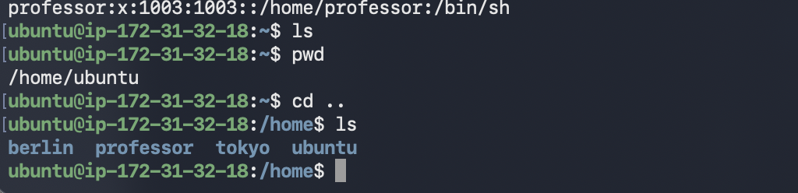
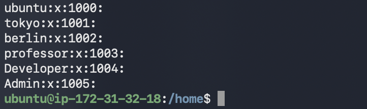
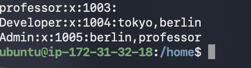
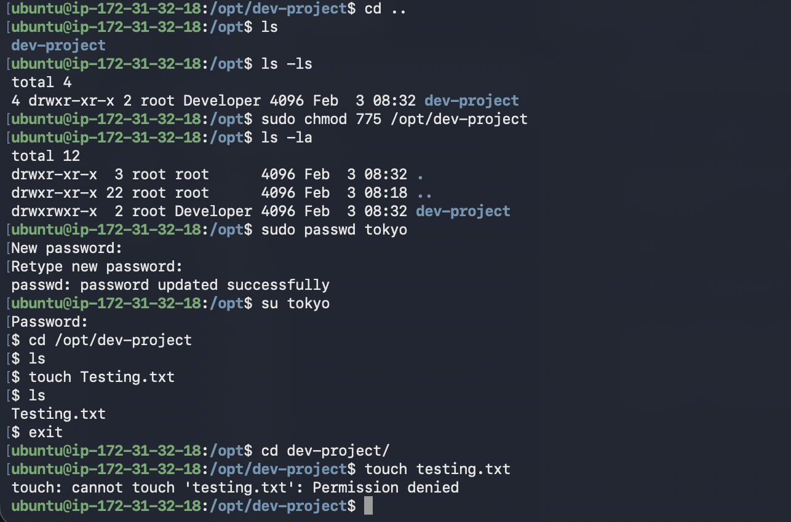
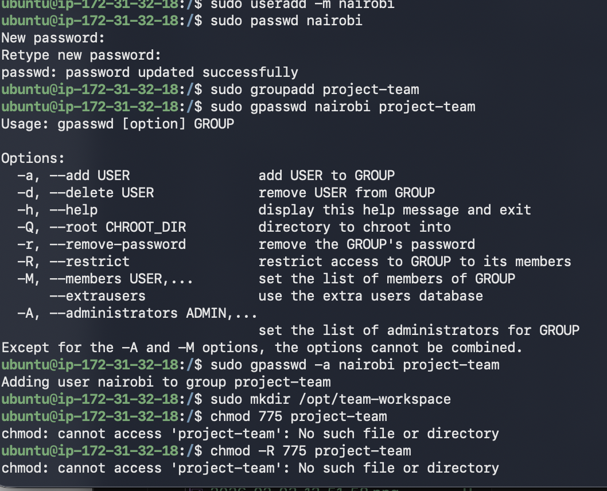
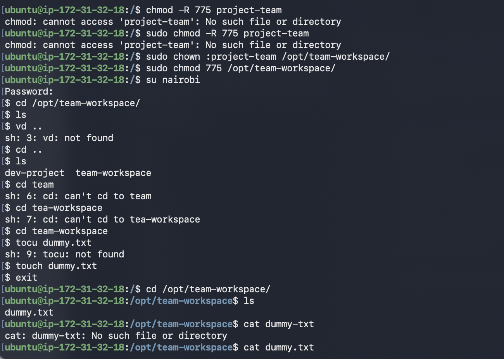

# Day 9 of 90dayschallenge

# Part-1 Create Users 

I have created three different user using sudo useradd -m "Name" and verified using 
cat /etc/passwd/ and /home/ ls command.

# Part-2 Create Groups

I have created two different group name developer and tester using sudo groupadd "name" command below screenshot shows the group:

# Part-3 Assign to Groups

I have assigned different user to there respective group using sudo gpasswd -a "Username" "Groupname"

# Part-4 Shared Directory

I have created a new directory and chaged the group using mkdir /opt/dev-project and changed group owner using chown "Name of group" "Path" and I have changed directory permission using chmod 775 "name" and I have verified the same using tokyo user and created  a new file testing in that folder 

# Part-5: Team Workspace
I have completed all the below step and mentioned the command that I have used for doing the operation.
1. Create user `nairobi` with home directory - Sudo Useradd -m nairobi
2. Create group `project-team` - Sudo groupadd project-team
3. Add `nairobi` and `tokyo` to `project-team` - sudo gpasswd -a nairobi project-team
4. Create `/opt/team-workspace` directory - mkdir /opt/team-workspace
5. Set group to `project-team`, permissions to `775` chown :project-team opt/team-workspace
6. Test by creating file as `nairobi` - I have switched user using su nairobi command and verified the same 

## What I Learned
Today I learned to create different user and group 
Set and restrict permission of a file and folder
I learner how to manage the user an group and assign user to a group.

