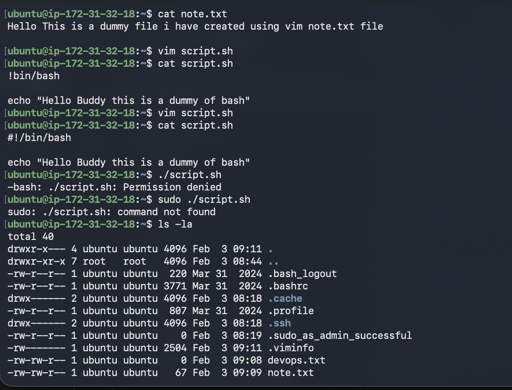
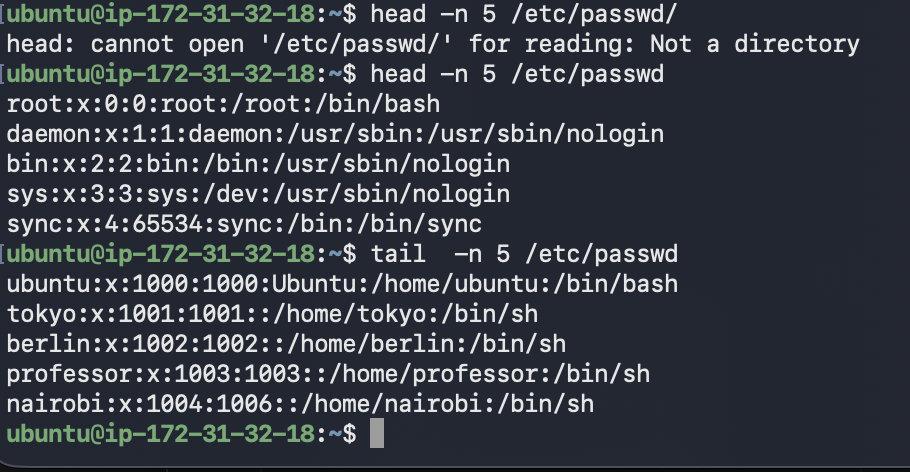
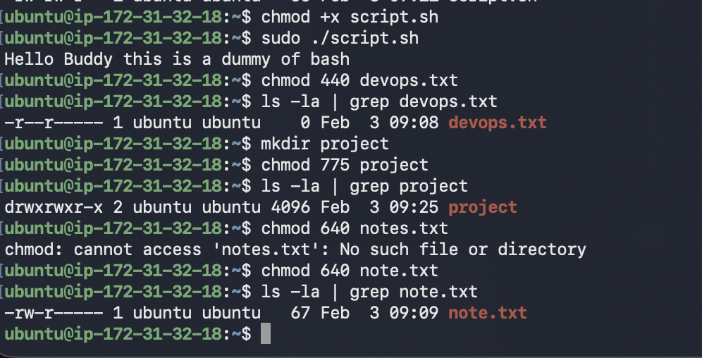

# Day 10 of 90dayschallenge

# Part-1: Create Files
I have created a empty file `devops.txt` using touch devops.txt command 
I have Created  `notes.txt` using vim notes.txt command and verified the same using cat notes.txt
I have created `script.sh` using vim with content: `echo "Hello DevOps"`

# Part-2: Read Files
I have used Cat command to read the file 
I have used Vim script.sh command to see the content
I have Displayed first 5 lines of `/etc/passwd` using head -n 5 /etc/passwd
I have Display last 5 lines of `/etc/passwd` using tail -n 5 /etc/passwd

# part-3: Understand Permissions

-rw-rw-r-- 1 ubuntu ubuntu    0 Feb  3 09:08 devops.txt
-rw-rw-r-- 1 ubuntu ubuntu   67 Feb  3 09:09 note.txt
-rw-rw-r-- 1 ubuntu ubuntu   56 Feb  3 09:11 script.sh

So first file has read and write permission for user and read and write permission for owner and read only permission for others
same for the other three files as well

# Part-4: Modify Permissions

1. Make `script.sh` executable → run it with `./script.sh` i have used chmod +x .script.sh
2. Set `devops.txt` to read-only - chmod 44 for devops.txt
3. Set `notes.txt` to `640` chmod 640 notes.txt
4. Create directory `project/` with permissions `755` - I have created a new directory mkdir project and set permission using chmod 755

# Part-5: Test Permissions 

1. Try writing to a read-only file - what happens?
When I tried writing two a file without. the write permission i got a error saying E45:"readonly" 
2. Try executing a file without execute permission
when I tired to execute a scipt without execute permission got an error saying permission denied

I have learned to create file and folder
I have learner to manage permission of file and folder and how ristrict acces to a file 

# Thank You!