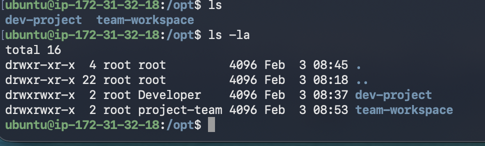
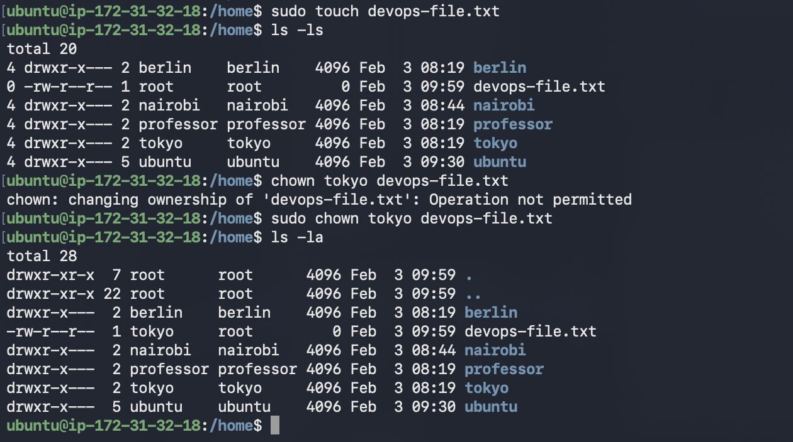
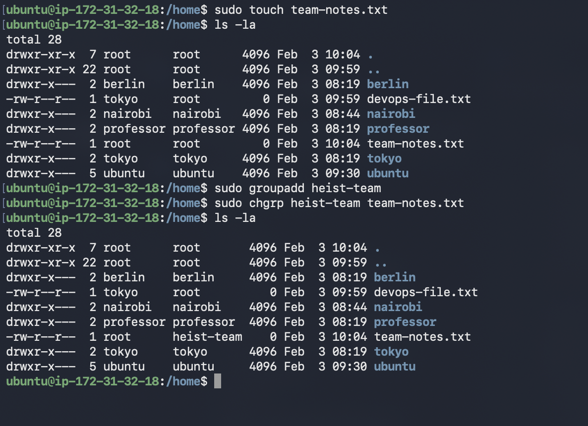
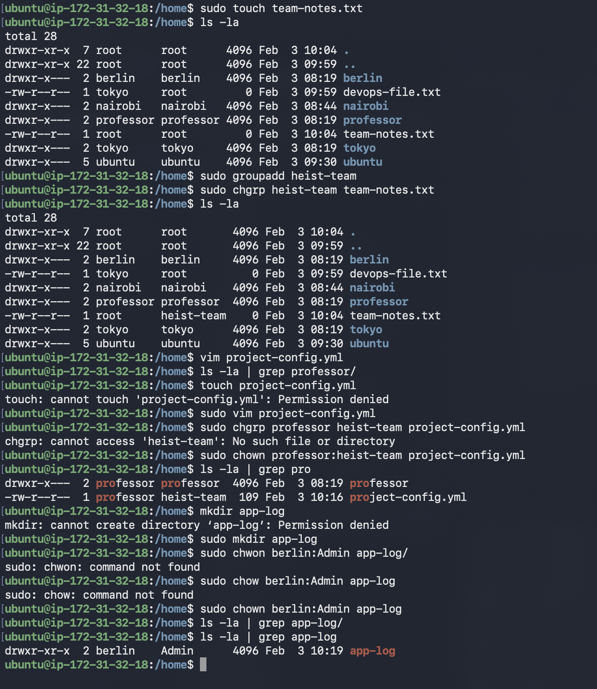
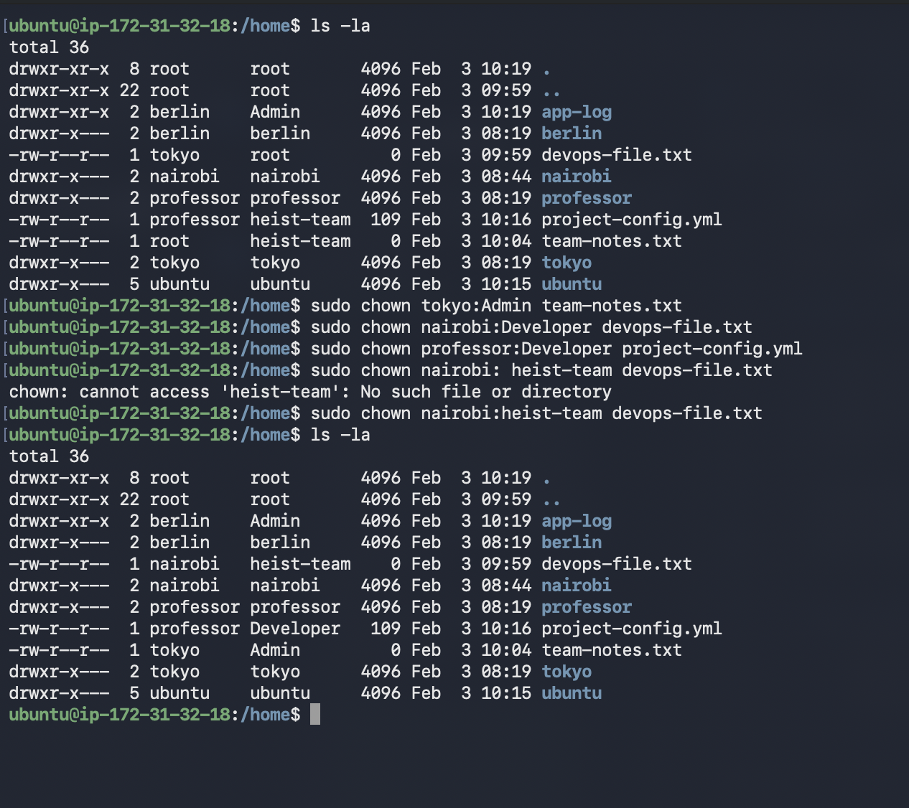

# Day 11 of 90dayschallenge 

# Task 1: Understanding Ownership 

Taking the reference of below screenshot 
I can say that the owner ship for dev-project and other folder belong to root user but there are different group that have access to these directory 
Owner is the user who owns the file and folder and have full control over the folder and file
Group is the set of associated member who has been assign to access the folder with the limited permissions 

# Task 2: Basic chown Operations 

I have created a file using touch and changed the permission file using chown command and verified the changes using ls -la
1. Create file `devops-file.txt` - touch devops-file.txt
2. Check current owner: `ls -l devops-file.txt` - ls -la
3. Change owner to `tokyo` (create user if needed) - sudo chown tokyo devops-file.txt
4. Change owner to `berlin`
5. Verify the changes - ls -la

# Task 3: Basic chgrp Operations (15 minutes)
I have created a file using touch team-notes.txt and checked for the ownership using ls -la command and created a group using sudo groupadd heist-team and change group using sudo chgrp heist-team team-notes.txt and later verified using command ls -la 
1. Create file `team-notes.txt`. - touch team-note.txt
2. Check current group: `team-notes.txt` - ls -la | grep team-notes.txt
3. Create group sudo groupadd heist-team
4. Change file group to chgrp heist-team team-notes.txt
5. Verify the change -ls -la

# Task 4: Combined Owner & Group Change
I have created a file using vim project-config.yml and checked for the ownership using ls -la command and  change group using sudo chown professor:heist-team project-config.yml and later verified using command ls -la 
1. Create file `project-config.yaml` - sudo vim project-config.yml
2. Change owner to `professor` AND group to `heist-team` (one command) -sudo chown name:groupname filename
3. Create directory `app-logs/` sudo mkdir app-logs
4. Change its owner to `berlin` and group to `heist-team` -sudo chown name:groupnamr filename

# Task 6: Practice Challenge (20 minutes)
I have setup different ownership and group for the different file and verified the same using ls -la I have also attached a screenshot for the reference 

5. Set different ownership:
   - owner-tokyo. group-Admin filename- team-notes.txt 
   - owner-professor group-Developer filename- project-config.yml
   - owner-nairobi group-heist-team filename-devops-file.txt 

# Thank You!