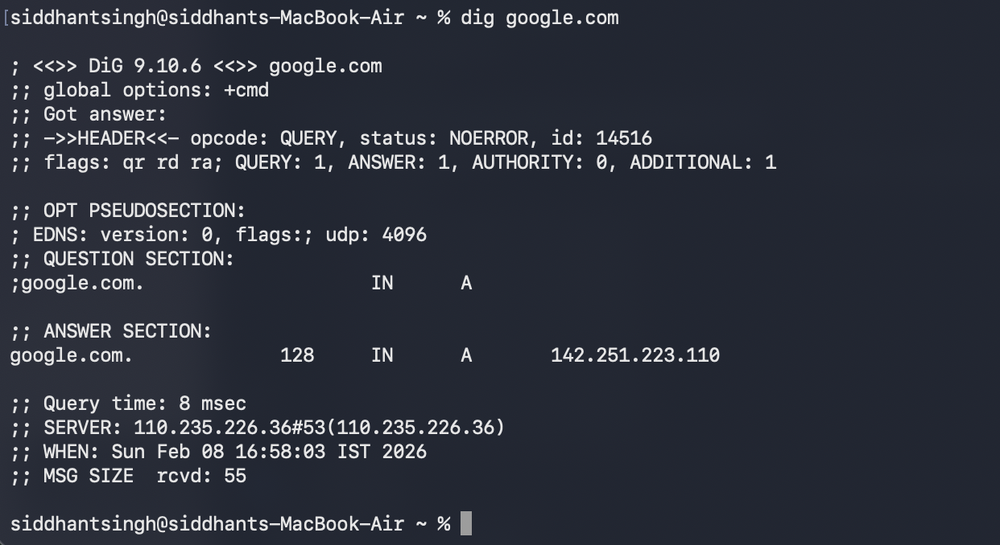
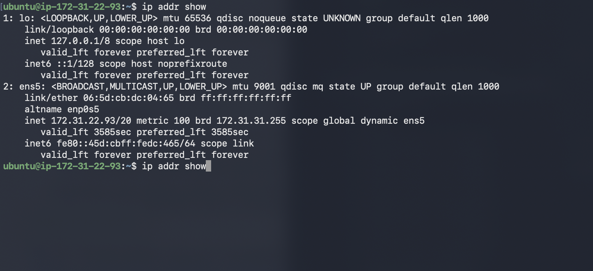
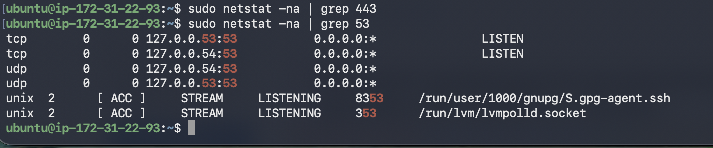

# Day 15 of 90dayschallenge

### Task 1: DNS – How Names Become IPs
1. Explain in 3–4 lines: what happens when you type `google.com` in a browser?
Ans- when we type google.com our reques first go to root then it flows to generic domain such as .com then it search for google and looks for the ip address which is mapped to the particular domain and then resolve the request and we access google.com

2. Run: `dig google.com` — identify the A record and TTL from the output
This command provides the datils about the google.com and corresponding ip address of it

1. What is an IPv4 address? How is it structured? 
Ip address is a unique identity that is assing to particuklar device Ipv4 is a ip range that start 0.0.01 to 256.256.256.255 it if of 4 bytes and 8 bites
2. Difference between **public** and **private** IPs — give one example of each
Public ip - is accessable for anyone in world eg public ip - 54.34.65.8
private ip - is not accessible for everyone is only avaible for the owner and those have access to server private ip - 10.2.2.4

4. Run: `ip addr show` — identify which of your IPs are private
when we run ip addr show is display private ip as inet *.*.*.* metric 100 

### Task 3: CIDR & Subnetting
1. What does `/24` mean in `192.168.1.0/24`?
this means 32-24=8 which 2^8=256 ip address are available
2. How many usable hosts in a `/24`? A `/16`? A `/28`?
for /24=256 ip as shown above
for /16= 32-16=16 2^16=65536 ip address is available
for /28 =32-28 = 4 2^4=16 ip address is availble
3. Explain in your own words: why do we subnet?
subnet is a networking concept which help us devide our vpc ip into smaller group which help us to increase the usage of ip address and provides security
4. Quick exercise — fill in:

| CIDR | Subnet Mask | Total IPs | Usable Hosts |
|------|-------------|-----------|--------------|
| /24  |10.10.10.0/24| 256       | 256          |
| /16  |10.10.0.0/16 | 65536     | 65536        |
| /28  |10.10.10.0/28| 16         | 16          |

1. What is a port? Why do we need them?
ports are unique number that help us access our application
2. Document these common ports:

| Port | Service |
|------|---------|
| 22   | ssh     |
| 80   | http    |
| 443  |https    |
| 53   |DNS      |
| 3306 | mysql   |
| 6379 |redis cah|
| 27017|mongodb  |

### Task 5: Putting It Together
Answer in 2–3 lines each:
- You run `curl http://myapp.com:8080` — what networking concepts from today are involved?
when we run curl -i command is tries to reach to that serverr and display weather it is able to communicate for not
- Your app can't reach a database at `10.0.1.50:3306` — what would you check first?
we will first that in our inbound rule that this prot is availble for external use or not then we will tri to curl it and then also not able to access we will netstat -na |grep 3306 to check why we are not able to access

