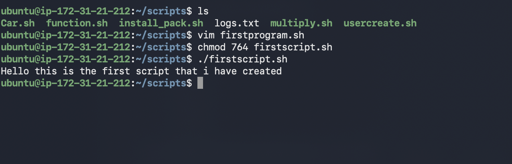
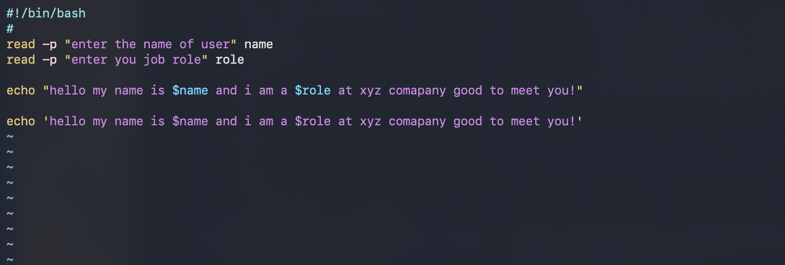
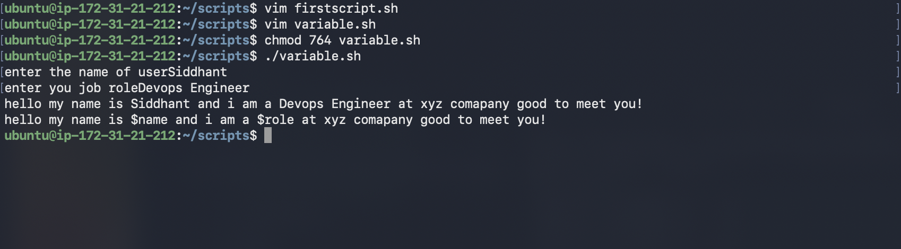
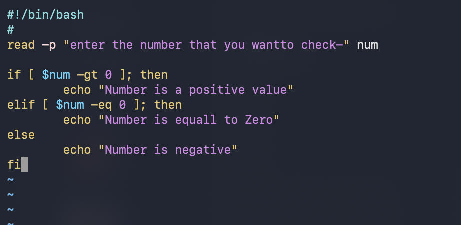
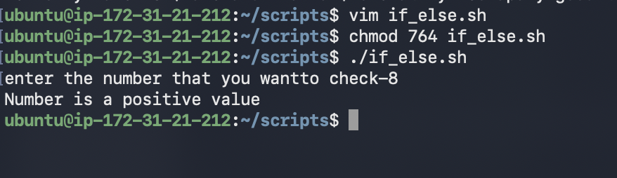
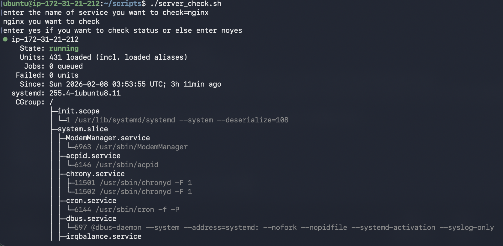

# day 16 of 90dayschallenge

# Task 1: Your First Script
1. Create a file - I have created a new file name firstscript.sh using vim firstscript.sh command 
2. Add the shebang line - we add shedbang in order to make shell understand that it a bash script and it is defined as "#!/bin/bash"
3. Print - to print i have used echo "Hello world this the first script i have created"
4. Make it executable and run it- first we have to change permission using chmod 764 filename in order to make it execuatable and we can run it using ./firstscript.sh

# Task - 2 and 3 Variable and User Input with read
1. Create `variables.sh` vim variable.sh to create a file name varibable file
   - A variable for your `NAME`
   - A variable for your `ROLE` (e.g., "DevOps Engineer")
   - Print: `Hello, I am <NAME> and I am a <ROLE>`
2. Try using single quotes vs double quotes — what's the difference?
In single quote it teat everything as string even the $variable also but in the double quotes it treat $var as a variable display the command that we have enterted
below are the screenshot for reference
3. I have taken the input from the user for there name and role using read -p command and attached the screenshot below for the reference we use read command to take input from the user.

# Task 4: If-Else Conditions
1. Create `check_number.sh` that:
   - Takes a number using `read`
   - Prints whether it is **positive**, **negative**, or **zero**
I have craeated a script to check weathera number is positive or neg using if else command
syntax for if else is 
if ; then
else
fi
to end a if condition in bash we use fi command

### Task 5: Combine It All
Create `server_check.sh` that:
1. Stores a service name in a variable (e.g., `nginx`, `sshd`)
2. Asks the user: "Do you want to check the status? (y/n)"
3. If `y` — runs `systemctl status <service>` and prints whether it's **active** or **not**
4. If `n` — prints "Skipped."

I have created a script a to check the status of the service and i have taken the input from the user and then process it based on the requirement 
Script:
read -p "enter the name of service you want to check=" service
echo "$service you want to check"
read -p "enter yes if you want to check status or else enter no" input
if [ $input == 'yes' ]; then
        systemctl status $serivce
else
        echo "You skipped to check the status"
fi

Today 
I have learned basic of shell scripting
I have learned how to declare a variable
I have learned about the if condition and how to take the input form the user.