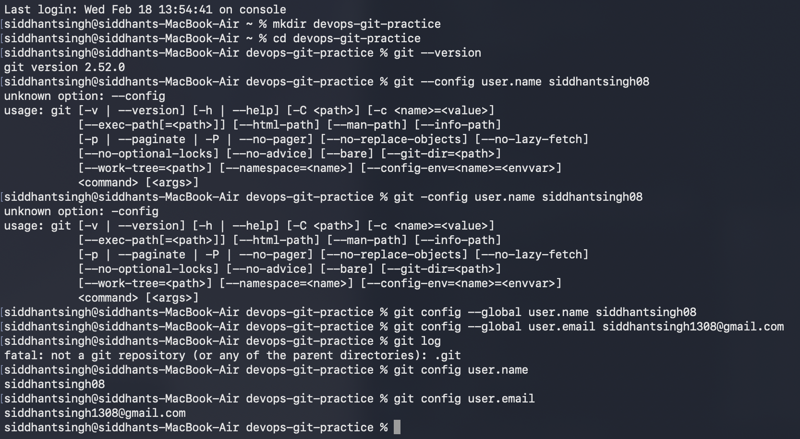
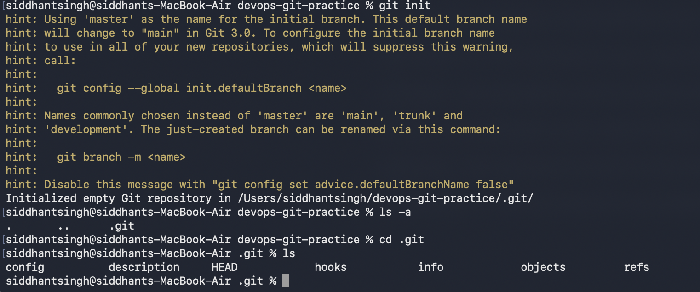
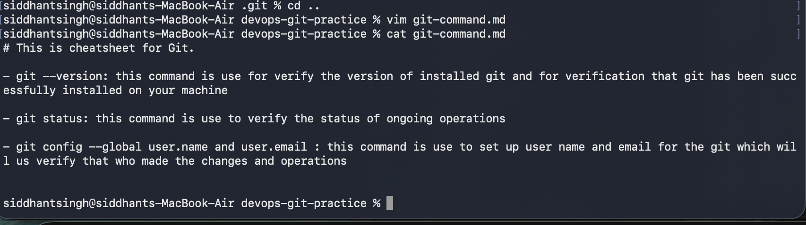
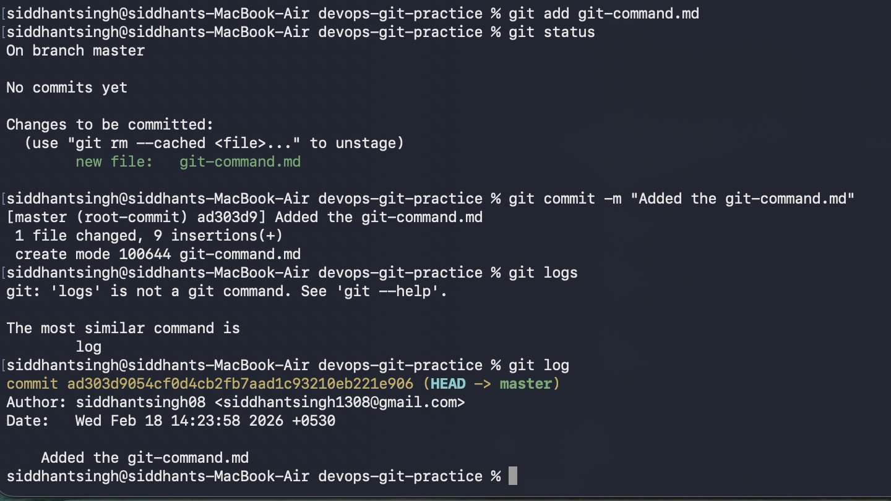
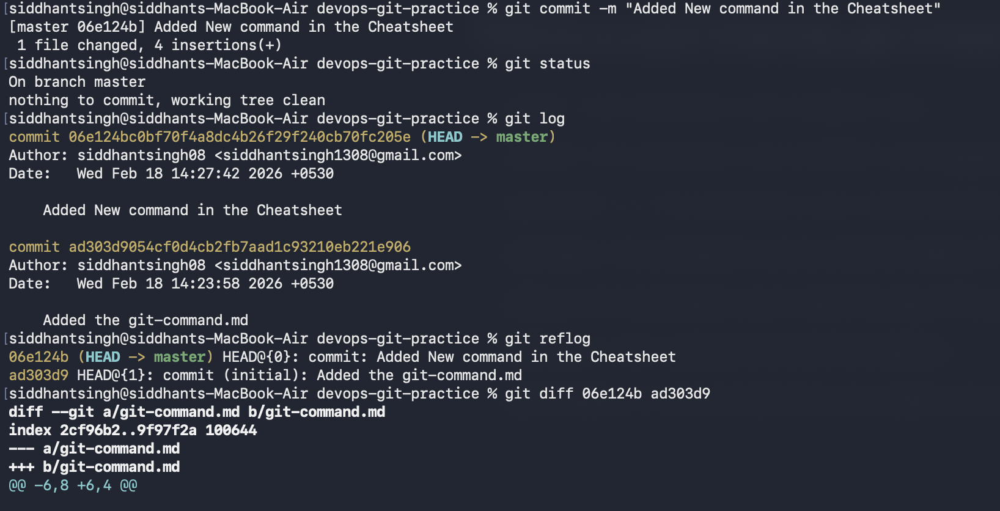

# day 22 of 90daysofdevops

### Task 1: Install and Configure Git
1. Verify Git is installed on your machine
- I have installed git on the local machine using cli and verified it using git --version command 
2. Set up your Git identity — name and email
- I have set up the email and user name using git config --global user.name "" and git config --global user.email "" command to set up email and name
3. Verify your configuration
I have verified the config using git logs and I have attached the screenshot for reference.

### Task 2: Create Your Git Project
1. Create a new folder called `devops-git-practice`
- I have created a folder using mkdir command on my local machine 
2. Initialize it as a Git repository
- I have initialize the git repo using git init command 
3. Check the status — read and understand what Git is telling you
- I have verified the status using git status command 
4. Explore the hidden `.git/` directory — look at what's inside
- I have viewed the .git/ dir using ls -a command and i have attached the screenshot for the reference 

### Task 3: Create Your Git Commands Reference
1. Create a file called `git-commands.md` inside the repo
- I have created a file inside the git repo folder user vim git-command.md and i have added the basic command in that has been used till now 
2. Add the Git commands you've used so far, organized by category:
- I have added the git command in the cheatsheet 
3. For each command, write:
- I have added the command and why it is used in the sheet 
I have attached the screenshot for the reference

### Task 4: Stage and Commit
1. Stage your file
- I have staged the file using git add filename commands
2. Check what's staged
- I have verified the changes using git status command.
3. Commit with a meaningful message
- I have commited it using git commit -m "added git cheatsheat"
4. View your commit history
- I have verified the commit commit history using git log 
I have attached the screenshot for the reference 

### Task 5: Make More Changes and Build History
1. Edit `git-commands.md` — add more commands as you discover them
- I have made the changes in the chit using vim command 
2. Check what changed since your last commit
- I have verified the changes using git log 
3. Stage and commit again with a different, descriptive message
- Done
4. Repeat this process at least **3 times** so you have multiple commits in your history
- Done
5. View the full history in a compact format
- git reflog 

### Task 6: Understand the Git Workflow
Answer these questions in your own words (add them to a `day-22-notes.md` file):
1. What is the difference between `git add` and `git commit`?
- git add command is use to move changes to thee staging area and git command is use to added it git 
2. What does the **staging area** do? Why doesn't Git just commit directly?
- git first add it staging area before commiting it to git directly because user can verify what changes are being pushed to git  
3. What information does `git log` show you?
git log show tthe commit history with the user name and email who made those changes
4. What is the `.git/` folder and what happens if you delete it?
it is created again
5. What is the difference between a **working directory**, **staging area**, and **repository**?
working directory - Is the place wgere we work on the local machine 
staging area - Is the area where we first add our changes before commiting it git for the final check
repo - Is the place where we stores our data on remote local 
